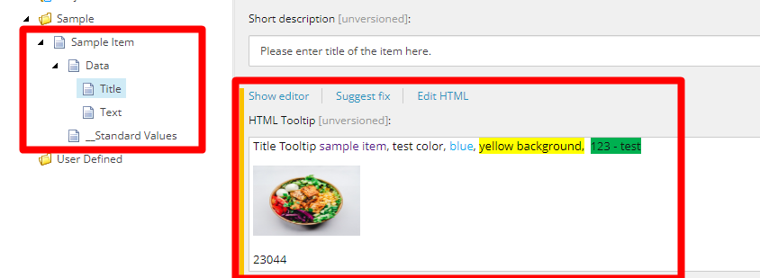
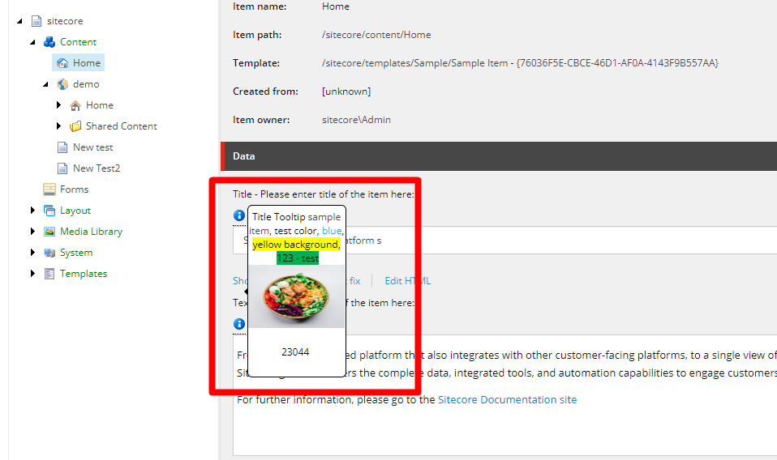

# Sitecore Customized Content Editor (HTML Tooltip)
**Sitecore version**: Sitecore 10.3.0 (rev. 008463)

 **Steps: (This is for quick installatin where there is no need for any customization )** 
1) Comment out the following line from Sitecore.config.
```
    <renderContentEditor>
      <!--<processor type="Sitecore.Shell.Applications.ContentEditor.Pipelines.RenderContentEditor.RenderStandardContentEditor, Sitecore.Client" />-->
    </renderContentEditor>
```
2) Download this package to your sitecore insatance : Package/HTMLTooltipNoCustomization-1.zip

**If you want to do more customization please follow the following steps:**

1) Install the sitecore package Package/TooltipHTMLField-1.zip.
2) Publish the project to the root folder of Sitecore.
3) Navigate to src\SitecoreCustomizedContentEditor\SitecoreCustomizedContentEditor\sitecore\shell\themes\standard\default\customhelptooltip.css file, where you can modify the css classes.
4) GenerateIcon Method under : src\SitecoreCustomizedContentEditor\SitecoreCustomizedContentEditor\Processors\CustomEditorFormatter.cs  to change the css class and HTML for the item.
5) Navigate to "HTML Tooltip" field, and add your rich text content, you should see an icon on each field for this tooltip that will display and HTML content.
  
**Screenshots:**
 
  
  <kbd></kbd>
  
 <kbd> </kbd>
